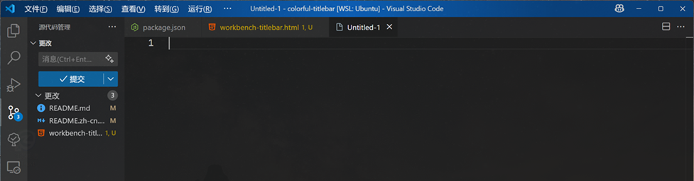

# Colorful Titlebar

[中文版本](README.zh-cn.md) | **English**

A VS Code extension that adds colorful background colors to the title bar based on your project name.

## ✨ Features

- 🎨 **Project-based Colors**: Automatically generates unique colors based on your project
- 🔄 **Multiple Hash Sources**: Choose from project name, full path, or project name + date
- 🌈 **Customizable Color Palettes**: Separate color schemes for light and dark themes
- 📁 **Smart Project Detection**: Configurable file/folder indicators to identify projects
- 🌍 **Multi-language Support**: Full Chinese and English interface
- ✨ **Gradient Overlay Effects**: Add beautiful gradient overlays to enhance the titlebar appearance (requires CSS hacking)

## ⚠️ Important Notice

**The gradient feature modifies VS Code's core CSS files**, which may trigger VS Code's integrity check and show a "corrupted" warning. This is expected behavior and doesn't affect functionality. The extension automatically creates backups before any modifications.

## 📦 Installation

1. Clone or download this project
2. Run `pnpm install` in the project directory
3. Run `pnpm build` to compile the extension
4. Press `F5` to test the extension in a new VS Code window

## 🚀 Usage

### Commands

- **Enable Gradient Overlay**: `Ctrl+Shift+P` → "Enable Titlebar Gradient"
- **Disable Gradient Overlay**: `Ctrl+Shift+P` → "Disable Titlebar Gradient"

### Gradient Styles

- **Bright Center**: Linear gradient with a bright center effect

  

- **Bright Left**: Radial gradient with a bright effect from the left side

  

### Requirements

The extension requires VS Code's title bar style to be set to "custom". If not configured, the extension will prompt you to change it automatically.

**For gradient features**: The extension needs to modify VS Code's core CSS files. It will automatically detect your VS Code installation or allow you to specify a custom path.

## ⚙️ Configuration

Open VS Code settings and configure the following options:

### `colorful-titlebar.enabled`

- **Type**: boolean
- **Default**: `true`
- **Description**: Enable or disable the colorful titlebar effect

### `colorful-titlebar.hashSource`

- **Type**: string
- **Default**: `"projectName"`
- **Options**:
  - `"projectName"`: Generate color from project folder name only
  - `"fullPath"`: Generate color from complete project path
  - `"projectNameDate"`: Generate color from project name and current date
- **Description**: Source for generating hash-based colors

### `colorful-titlebar.lightThemeColors`

- **Type**: array of strings
- **Default**: `["rgb(167, 139, 250)", "rgb(147, 197, 253)", ...]`
- **Description**: Color palette for light themes
- **Supports**: `#RRGGBB`, `#RRGGBBAA`, `rgb()`, `rgba()`, `hsl()`, `hsla()`

### `colorful-titlebar.darkThemeColors`

- **Type**: array of strings
- **Default**: `["rgb(68, 0, 116)", "rgb(0, 47, 85)", ...]`
- **Description**: Color palette for dark themes
- **Supports**: `#RRGGBB`, `#RRGGBBAA`, `rgb()`, `rgba()`, `hsl()`, `hsla()`

### `colorful-titlebar.projectIndicators`

- **Type**: array of strings
- **Default**: `[".git", "package.json", "pom.xml", ...]`
- **Description**: If your workspace contains one item of this array, we shall consider it as a **project** and generate an unique color for the titlebar.

### `colorful-titlebar.workbenchCssPath`

- **Type**: string
- **Default**: `""`
- **Description**: Custom path to the workbench.desktop.main.css file.

### `colorful-titlebar.showInfoPop`

- **Type**: boolean
- **Default**: `true`
- **Description**: Whether to show information messages

## 🔧 How It Works

### Basic Color Application

1. **Project Detection**: Checks for configured indicator files (like `.git`, `package.json`)
2. **Color Generation**: Creates a hash from the selected source (project name/path/date)
3. **Color Selection**: Maps the hash to a color from your configured palette
4. **Theme Awareness**: Uses different color palettes for light and dark themes
5. **Titlebar Update**: Applies the color to VS Code's titlebar background

### Gradient Enhancement (Advanced)

1. **CSS File Detection**: Locates VS Code's `workbench.desktop.main.css` file
2. **Automatic Backup**: Creates a backup before any modifications
3. **CSS Injection**: Adds gradient overlay styles with a unique token
4. **Style Selection**: Choose from different gradient effects (bright center, bright left)
5. **Easy Restoration**: Remove gradients with the disable command, which restores from backup

## 📋 Requirements

- VS Code 1.74.0 or higher
- Title bar style must be set to "custom" (extension will help you configure this)

## ⚠️ Notes

- The extension modifies VS Code's workspace settings for basic color functionality
- **Gradient features modify VS Code's core CSS files** and may trigger integrity warnings
- Different projects will have consistent colors based on your hash source choice
- Colors automatically adapt to your current theme (light/dark)
- Gradient overlays are automatically backed up and can be safely removed
- VS Code may show "corrupted" warnings when using gradient features - this is expected and safe

## 📄 License

MIT License - see [LICENSE](LICENSE) file for details.

## 🤝 Contributing

Issues and Pull Requests are welcome!

## 📝 Changelog

### 0.0.1

- Initial release
- Project-based color generation
- Multi-language support
- Customizable color palettes
- Smart project detection

### 1.0.0

- Beautiful gradient overlay effects. Inspired by Idea
