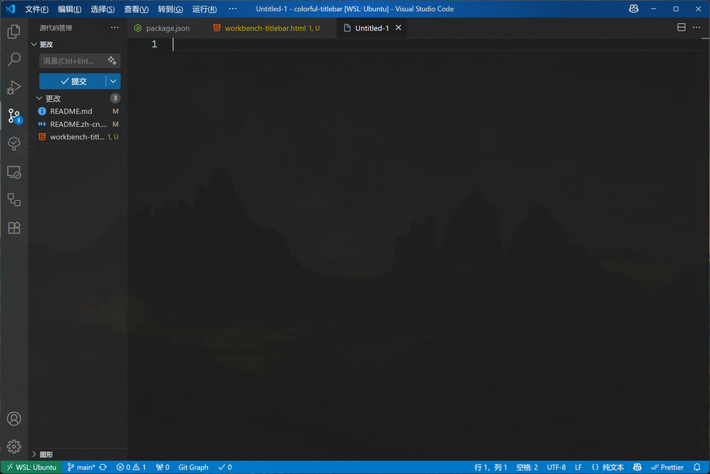
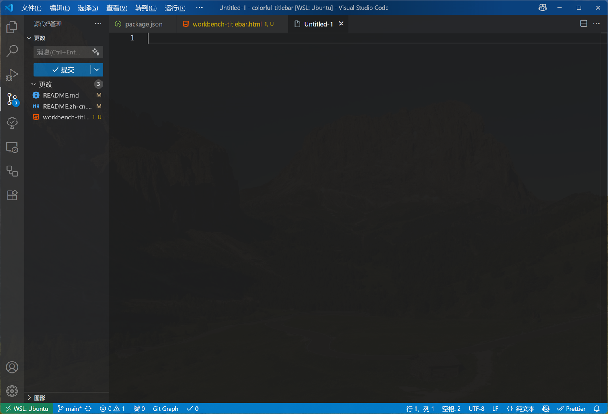
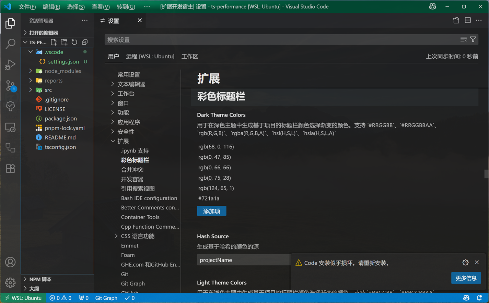

# 彩色标题栏

**中文** | [English](README.md)

一个基于项目名称为 VS Code 标题栏添加彩色背景的扩展。

## ✨ 功能特性

- 🎨 **基于项目的颜色**: 根据你的项目自动生成独特的颜色
- 🔄 **多种哈希源**: 可选择项目名称、完整路径或项目名称+日期
- 🌈 **可自定义调色板**: 为浅色和深色主题分别设置颜色方案
- 📁 **智能项目检测**: 可配置文件/文件夹指示器来识别项目
- 🌍 **多语言支持**: 完整的中英文界面
- ✨ **渐变叠加效果**: 添加美丽的渐变叠加来增强标题栏外观（需要 CSS 修改）

## ⚠️ 重要提示

**渐变功能会修改 VS Code 的核心 CSS 文件**，这可能触发 VS Code 的完整性检查并显示"损坏"警告。这是预期行为，不会影响功能。扩展会在任何修改前自动创建备份。

## 📦 安装

1. 克隆或下载此项目
2. 在项目目录中运行 `pnpm install`
3. 运行 `pnpm build` 编译扩展
4. 按 `F5` 在新的 VS Code 窗口中测试扩展

## 🚀 使用方法

### 命令

- **启用标题栏渐变**: `Ctrl+Shift+P` → "启用标题栏渐变"
- **禁用标题栏渐变**: `Ctrl+Shift+P` → "禁用标题栏渐变"

### 渐变样式

- **亮中心**: 带有亮中心效果的线性渐变

  

- **亮左侧**: 从左侧产生亮效果的径向渐变

  

- **左侧弧光**: 从左侧产生亮效果的径向渐变 2

  

### 前置要求

扩展需要将 VS Code 的标题栏样式设置为"自定义"。如果未配置，扩展会提示你自动更改。

**对于渐变功能**: 扩展需要修改 VS Code 的核心 CSS 文件。它会自动检测你的 VS Code 安装路径，或允许你指定自定义路径。

扩展需要 VS Code 的标题栏样式设置为"custom"。如果未配置，扩展将提示你自动更改。

## ⚙️ 配置选项

打开 VS Code 设置并配置以下选项：

### `colorful-titlebar.enabled`

- **类型**: 布尔值
- **默认值**: `true`
- **描述**: 启用或禁用彩色标题栏效果

### `colorful-titlebar.hashSource`

- **类型**: 字符串
- **默认值**: `"projectName"`
- **选项**:
  - `"projectName"`: 仅从项目文件夹名称生成颜色
  - `"fullPath"`: 从完整项目路径生成颜色
  - `"projectNameDate"`: 从项目名称和当前日期生成颜色
- **描述**: 生成基于哈希的颜色的源

### `colorful-titlebar.lightThemeColors`

- **类型**: 字符串数组
- **默认值**: `["rgb(167, 139, 250)", "rgb(147, 197, 253)", ...]`
- **描述**: 浅色主题的调色板
- **支持格式**: `#RRGGBB`, `#RRGGBBAA`, `rgb()`, `rgba()`, `hsl()`, `hsla()`

### `colorful-titlebar.darkThemeColors`

- **类型**: 字符串数组
- **默认值**: `["rgb(68, 0, 116)", "rgb(0, 47, 85)", ...]`
- **描述**: 深色主题的调色板
- **支持格式**: `#RRGGBB`, `#RRGGBBAA`, `rgb()`, `rgba()`, `hsl()`, `hsla()`

### `colorful-titlebar.projectIndicators`

- **类型**: 字符串数组
- **默认值**: `[".git", "package.json", "pom.xml", ...]`
- **描述**: 如果 VS Code 打开的目录包含这些文件中的一个，那么它会被认为是一个**项目**，从而拥有彩色标题栏

### `colorful-titlebar.workbenchCssPath`

- **类型**: 字符串
- **默认值**: `""`
- **描述**: workbench.desktop.main.css 文件的自定义路径。

### `colorful-titlebar.showInfoPop`

- **类型**: 布尔值
- **默认值**: `true`
- **描述**: 是否显示信息提示消息

## 🔧 工作原理

### 基础颜色应用

1. **项目检测**: 检查配置的指示器文件（如 `.git`, `package.json`）
2. **颜色生成**: 从选定的源（项目名称/路径/日期）创建哈希
3. **颜色选择**: 将哈希映射到你配置的调色板中的颜色
4. **主题感知**: 为浅色和深色主题使用不同的调色板
5. **标题栏更新**: 将颜色应用到 VS Code 的标题栏背景

### 渐变增强（高级功能）

1. **CSS 文件检测**: 定位 VS Code 的 `workbench.desktop.main.css` 文件
2. **自动备份**: 在任何修改前创建备份
3. **CSS 注入**: 使用唯一标记添加渐变叠加样式
4. **样式选择**: 从不同的渐变效果中选择（亮中心、亮左侧）
5. **轻松恢复**: 使用禁用命令移除渐变，从备份中恢复

## 📋 系统要求

- VS Code 1.74.0 或更高版本
- 标题栏样式必须设置为"custom"（扩展将帮助你配置此项）

## ⚠️ 注意事项

- 扩展会修改 VS Code 的工作区设置用于基础颜色功能
- **渐变功能会修改 VS Code 的核心 CSS 文件**，可能会触发完整性警告
- 不同项目将根据你的哈希源选择获得一致的颜色
- 颜色会自动适应你当前的主题（浅色/深色）
- 渐变叠加会自动备份，可以安全移除
- 使用渐变功能时 VS Code 可能显示"损坏"警告 - 这是预期行为且安全

## 📄 许可证

MIT License - 查看 [LICENSE](LICENSE) 文件了解详情。

## 🤝 贡献

欢迎提交 Issue 和 Pull Request！

## 📝 更新日志

### 0.0.1

- 初始发布
- 基于项目的颜色生成
- 多语言支持
- 可自定义调色板
- 智能项目检测

### 1.0.0

- 漂亮的渐变叠加效果。灵感来自 Idea
